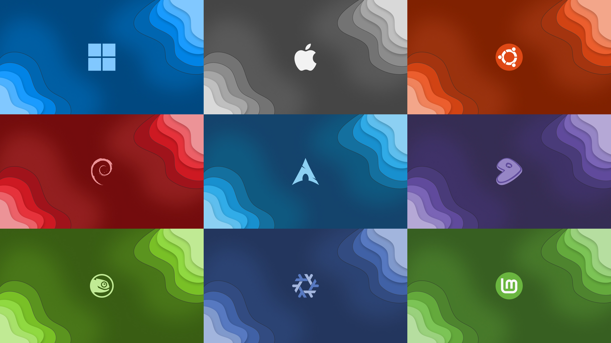

# awesome-wallpapers

**A collection of cool, custom-designed wallpapers for multiple operating systems!**

This project, a fork of Ayushman Tiwari's work on [GitLab](https://gitlab.com/ayushmantiwari/awesome-wallpapers), features unique wallpapers showcasing OS logos. Whether you're a fan of Linux, Windows or macOS, you'll find something here.

For phone wallpapers, check out the repository: [phone-wallpapers](https://github.com/dpejoh/phone-wallpapers).

## 



## Features

- Creative OS-inspired designs.
- Optimized for various screen resolutions.
- Open to custom wallpaper requests!

## Usage

1. Clone the repository:

```bash
git clone https://github.com/dpejoh/awesome-wallpapers.git
```

2. Browse and download your favorite wallpaper.

3. Set it as your desktop background.

## Requests

Want a custom design? Open an issue here.

## Contributing

**We Welcome Contributions!**

In order to contribute, You can:

1. Fork The Repository.
2. Clone It Locally.
3. Make your changes.
4. Commit your changes.
5. Open a Pull Request (PR).
