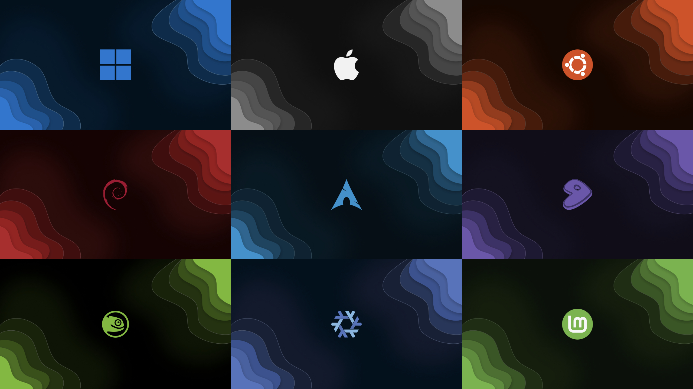

# awesome-wallpapers

A collection of cool, custom-designed wallpapers for multiple operating systems!

This project, a fork of Ayushman Tiwari's work on GitLab, features unique wallpapers showcasing OS logos. Whether you're a fan of Linux, Windows or macOS, you'll find something here.



## Features

- Creative OS-inspired designs.

- Optimized for various screen resolutions.

- Open to custom wallpaper requests!

## Usage

- Clone the repository:

```sh
git clone https://github.com/dpejoh/awesome-wallpapers.git
```

- Browse and download your favorite wallpaper.

- Set it as your desktop background.

## Requests

Want a custom design? Open an issue here.